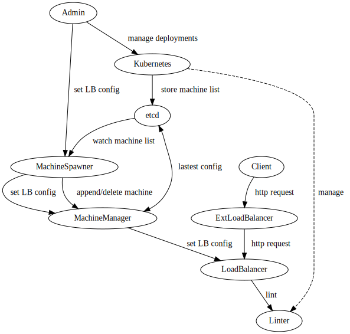

# Michał Chojnowski, Adam Czajkowski, Michał Radwański
# IRIO 2021-2022 "Distributed Linters" - design document

## Technologie
Nasze rozwiązanie działa na platformie Kubernetes. Zapewnia nam to:
- TODO

Większość kodu napisana jest w języku go, który ma następujące zalety:
- produkuje statyczne pliki wykonywalne, dzięki czemu deploy jest nieco prostszy
- ma dobrze wspierane klienty do używanych przez nas narzędzi googlowskich
(głównie do wykorzystywanej przez nas bazy danych, etcd, ale również do kubernetesa)
- zapewnia przyzwoitą wydajność
- posiada potrzebne nam komponenty takie jak na przykład serwer HTTP w bibliotece standardowej

## Architektura

Zdecydowaliśmy się skorzystać z usług typu serverless. Oszczędza nam to czasu.
Jako że działamy na bardzo małą skalę, koszt takiego rozwiązania jest w pełni akceptowalny.

Opis komponentów:
- Zewnętrzny load balancer - dany przez środowisko cloudowe rozrzuca zapytania
po instancjach naszych load balancerów
- Load balancer - czyta z etcd listę dostępnych maszyn, na których działają lintery do odpowiedniego języka
i zgodnie z przyjętą strategią rozrzuca między nie przychodzące zapytania
- Machine manager - otrzymuje powiadomienia od MachineSpawnera zarówno o maszynach nowo stworzonych,
jak i takich, które przestały odpowiadać na healthchecki i odpowiednio modyfikuje zapisy w etcd,
z których korzystają load balancery. Na zlecenie wrzuca nowe wersje linterów na maszyny
korzystając z danych znajdujących się w etcd.
- Machine spawner - tworzy nowe maszyny, zleca healthchecki usłudze typu cloud functions.
Przekazuje informacje o tych wydarzeniach machine managerowi.

<!-- TODO: komunikacja machine spawner <-> machine manager jakim kanałem - HTTP czy etcd? A może jakaś kolejka? -->

Planowaliśmy użyć jeszcze narzędzi do monitoringu, logowania, agregacji statystyk, ale ...TODO.

